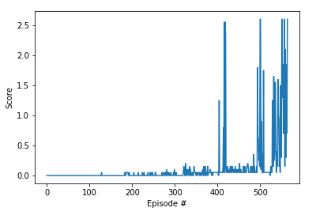

# Introduction
The goal of this project is to train agents to collaborate and compete in an environment. I set out to train two agents control rackets to bounce a ball over a net. Their goal is to keep the ball in play as long as possible. The environment, in this case, is the [Tennis](https://github.com/Unity-Technologies/ml-agents/blob/master/docs/Learning-Environment-Examples.md#tennis) environment. The observation space consists of 8 variables corresponding to the position and velocity of the ball and racket. Each agent receives its own, local observation. Two continuous actions are available, corresponding to movement toward (or away from) the net, and jumping. 

The task is episodic, and in order to solve the environment, the agents must get an average score of +0.5 (over 100 consecutive episodes, after taking the maximum over both agents).
* After each episode, the reward received by each agent (without discounting) is added up to get a score for each agent. This yields 2 (potentially different) scores. We then take the maximum of these 2 scores.
* This yields a single score for each episode.

The environment is considered solved, when the average (over 100 episodes) of those scores is at least +0.5.

# Learning Algorithm
I implemented the Deep Deterministic Policy Gradient (DDPG) algorithm from the [DDPG paper](https://arxiv.org/abs/1509.02971). This algorithm combines the actor-critic approach with insights from the recent success of Deep Q Network (DQN). The result is a model-free algorithm based on the deterministic policy gradient that can operate over continuous action spaces.

# Model Architecture
The neural network is implemented in class QNetwork. The neural network maps state to action values. The network has three fully-connected layers and a Relu activation function for all hidden layers. The low-dimensional networks had 2 hidden layers with 400 and 300 units respectively (≈ 130,000 parameters).

# Hyperparameter

The agent is implemented in class Agent. The replay buffer (memory)contains collections of experience tuples. In the network, I implement the Fixed Q-Targets as qnetwork_target. I define various hyperparameter. These hyperparameters are suggested for a DDPG in the original paper in the supplementary section (`Page 11`) but have been adapted to train in this environment.

* BUFFER_SIZE (`3e5`) - specifies the size of our replay buffer, a change in this value affect the number of experience tuple held at any time to learn from.
* BATCH_SIZE (`128`) - the mini-batch size of the training sample. 
* GAMMA (`0.99`) - discount factor for the collected reward.
* TAU (`3e-3`) - for the soft update of target parameters.
* LR_ACTOR (`2e-4`) - learning rate for actor-network.
* LR_CRITIC (`6e-4`) - learning rate for critic network.
* UPDATE_EVERY (`20`) - how often we learn from memory (repay buffer).
* LEARN_NUM  (`10`) - number of learning passes.
* EPSILON (`1.0`) - epsilon in the noise process (act step).
* EPSILON_DECAY(`1e-6`) - decay epsilon every update step.
* Ornstein-Uhlenbeck noise parameters
    * OU_SIGMA (`0.1`)
    * OU_THETA (`0.15`) 

# Plot of Rewards
The agent solves the environment at about 565 episodes. The average reward score at this state is over +0.5. A plot of the average reward for the training period can be seen below.

# Ideas for future work
* Further training might improve on the average score of the agent as indicated by the continuous steep climb of the average score plot. It is evident that the agent has not achieved the optimal policy.

* Further work could be to compare various multi-agent algorithms and their performance in solving the problem (DDPG vs D4PG vs MADDPG). As well as optimization algorithms (PPO vs PER).